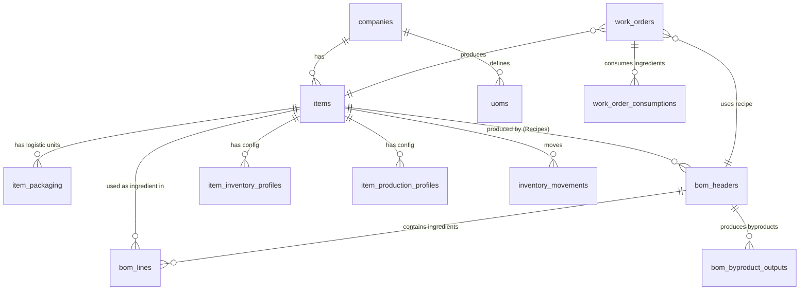

# Inventário Técnico - Produtos, Receitas e Estoque

Este documento detalha o estado atual do sistema (banco de dados, regras, telas e código) para servir de base à implementação do PCP.

## 1) BANCO DE DADOS

### **items**
*Tabela mestre de produtos e serviços.*
- **id**: UUID, PK
- **company_id**: UUID, FK -> companies.id
- **sku**: TEXT, Unique (per company), Nullable
- **name**: TEXT, Not Null
- **type**: TEXT, Check ('raw_material', 'packaging', 'wip', 'finished_good', 'service')
- **uom**: TEXT, Unit Abbreviation (Legacy field, kept for sync)
- **uom_id**: UUID, FK -> uoms.id (New standard)
- **gtin_ean_base**: TEXT (GTIN do produto na unidade base)
- **net_weight_kg_base**: NUMERIC
- **gross_weight_kg_base**: NUMERIC
- **is_active**: BOOLEAN, Default true
- **deleted_at**: TIMESTAMPTZ (Soft Delete)
- **Índices**: `items_company_name_idx`, `items_company_sku_unique`

### **uoms**
*Unidades de medida padronizadas.*
- **id**: UUID, PK
- **company_id**: UUID, FK -> companies.id
- **name**: TEXT
- **abbrev**: TEXT
- **Unique**: (company_id, abbrev)

### **item_packaging**
*Embalagens alternativas e unidades logísticas (ex: Caixa 12x).*
- **id**: UUID, PK
- **item_id**: UUID, FK -> items.id (O produto pai)
- **type**: TEXT, Check ('BOX', 'PACK', 'BALE', 'PALLET', 'OTHER')
- **label**: TEXT (Ex: "Caixa 12x1L")
- **qty_in_base**: NUMERIC (Fator de conversão para a unidade base)
- **gtin_ean**: TEXT (GTIN específico desta embalagem)
- **net_weight_kg**: NUMERIC
- **gross_weight_kg**: NUMERIC
- **height_cm / width_cm / length_cm**: NUMERIC
- **is_default_sales_unit**: BOOLEAN
- **deleted_at**: TIMESTAMPTZ (Soft Delete)

### **bom_headers**
*Cabeçalho da ficha técnica / receita.*
- **id**: UUID, PK
- **item_id**: UUID, FK -> items.id (O produto acabado)
- **version**: INT, Default 1
- **yield_qty**: NUMERIC (Rendimento padrão)
- **yield_uom**: TEXT
- **is_active**: BOOLEAN
- **Unique**: (company_id, item_id, version)
- **deleted_at**: TIMESTAMPTZ

### **bom_lines**
*Ingredientes e consumo da receita.*
- **id**: UUID, PK
- **bom_id**: UUID, FK -> bom_headers.id
- **component_item_id**: UUID, FK -> items.id (Ingrediente)
- **qty**: NUMERIC (Quantidade necessária)
- **uom**: TEXT (Unidade do ingrediente no momento do cadastro)
- **sort_order**: INT

### **inventory_movements**
*Livro razão de todas as movimentações de estoque.*
- **id**: UUID, PK
- **item_id**: UUID, FK -> items.id
- **movement_type**: TEXT ('ENTRADA', 'SAIDA', 'AJUSTE')
- **qty_base**: NUMERIC (Quantidade na unidade base, negativo para saída)
- **reason**: TEXT ('purchase_in', 'production_out', 'sale_out', etc.)
- **reference_type**: TEXT ('delivery_item', 'work_order', 'manual')
- **reference_id**: UUID
- **occurred_at**: TIMESTAMPTZ

### **work_orders**
*Ordens de produção.*
- **id**: UUID, PK
- **item_id**: UUID, FK -> items.id (Produto a fabricar)
- **bom_id**: UUID, FK -> bom_headers.id
- **planned_qty**: NUMERIC
- **produced_qty**: NUMERIC
- **status**: TEXT ('planned', 'in_progress', 'done', 'cancelled')

---

## 2) RELACIONAMENTOS



## 3) REGRAS E FLUXOS JÁ IMPLEMENTADOS

### Receita e Composição
- **Cadastro**: Feito na mesma tela do Produto (`ProductForm.tsx`), se o flag `is_produced` estiver ativo.
- **Vínculo**: Um `item` tem um `item_production_profile` que aponta para um `default_bom_id` (receita padrão).
- **Estrutura**: A receita (`bom_headers`) define um rendimento base (`batch_size`) e lista os ingredientes (`bom_lines`).

### Embalagens / Unidades Logísticas
- **Modelagem**: São cadastradas na tabela `item_packaging` vinculadas ao produto pai. 
- **Conceito**: Não são produtos separados (SKUs diferentes) na tabela `items`, mas sim "variações de apresentação" do mesmo ID de item.
- **Conversão**: O campo `qty_in_base` define quantos "unidades base" existem na embalagem. Ex: Caixa 12x1L -> `qty_in_base` = 12.
- **Uso**: Usadas principalmente para vendas e conferência de expedição. O estoque é controlado na unidade base.

### Estoque e Movimentações
- **Unidade de Controle**: Todo o estoque é, por padrão, rastreado na unidade base do item (`qty_base` em `inventory_movements`).
- **Trigger de Vendas**: Existe uma função/trigger complexa (`deduct_stock_from_route`) que baixa estoque quando uma rota de entrega é finalizada/confirmada. Ela varre os `delivery_items`, verifica o que foi *carregado* e gera movimentos de 'SAIDA'.
- **Produção**: Existe a estrutura para Ordens de Produção (`work_orders`), mas o fluxo de baixa automática de insumos e entrada de PA parece ser manual ou via API específica, não vi trigger automática de baixa de insumos ao concluir OP nos arquivos analisados.

---

## 4) TELAS / UI

### **Cadastro de Produto (Completo)**
- **Rota**: `/app/cadastros/produtos/novo` ou `/app/cadastros/produtos/[id]`
- **Componente**: `components/products/ProductForm.tsx`
- **Tabelas Lidas**: `items`, `uoms`, `tax_groups`, `bom_headers`, `item_packaging`.
- **Mutations**: Faz múltiplos `upsert` para salvar o item, perfis (fiscal, estoque, produção), receita (`bom_headers/lines`) e embalagens.

### **Listagem de Produtos**
- **Rota**: `/app/cadastros/produtos`
- **Mutations**: Soft delete de produtos.

### **Movimentações de Estoque**
- **Rota**: `/app/app/estoque/movimentacoes`
- **Componente**: Provavelmente `app/app/estoque/movimentacoes/page.tsx`.
- **Uso**: Visualização do razão de estoque (`inventory_movements`).

### **Ordens de Produção**
- **Rota**: `/app/app/producao/ordens`
- **Uso**: Gerenciamento de `work_orders`.

---

## 5) CÓDIGO

### Models / Types
- `types/product.ts`: Definições TS para `ProductFormData`, `ItemPackaging`, `Uom`.

### Frontend Logic
- `components/products/ProductForm.tsx`: Lógica central de cadastro, validação e salvamento em cascata.
- `lib/data/uoms.ts`: Helpers para buscar unidades.

### Database / Migrations (Source of Truth)
- `supabase/migrations/20251221222936_initial_schema_real.sql` (Schema base)
- `supabase/migrations/20251222023604_pcp_module.sql` (PCP Base: Items, BOMs, WorkOrders)
- `supabase/migrations/20251226180000_product_packaging.sql` (Packaging)
- `supabase/migrations/20260106001000_recreate_inventory_movements.sql` (Inventory Logic Refactor)

---

## 6) DDL (CREATE TABLES Principais)

```sql
-- ITEMS
CREATE TABLE public.items (
    id UUID PRIMARY KEY DEFAULT gen_random_uuid(),
    company_id UUID NOT NULL REFERENCES public.companies(id),
    sku TEXT,
    name TEXT NOT NULL,
    type TEXT CHECK (type IN ('raw_material', 'packaging', 'wip', 'finished_good', 'service')),
    uom_id UUID REFERENCES public.uoms(id),
    net_weight_kg_base NUMERIC,
    gross_weight_kg_base NUMERIC,
    is_active BOOLEAN DEFAULT true
);

-- PACKAGING
CREATE TABLE public.item_packaging (
    id UUID PRIMARY KEY DEFAULT gen_random_uuid(),
    item_id UUID NOT NULL REFERENCES public.items(id),
    type TEXT CHECK (type IN ('BOX', 'PACK', 'BALE', 'PALLET', 'OTHER')),
    label TEXT NOT NULL,
    qty_in_base NUMERIC NOT NULL CHECK (qty_in_base > 0),
    gtin_ean TEXT,
    net_weight_kg NUMERIC,
    gross_weight_kg NUMERIC,
    is_default_sales_unit BOOLEAN DEFAULT false
);

-- BOM HEADERS
CREATE TABLE public.bom_headers (
    id UUID PRIMARY KEY DEFAULT gen_random_uuid(),
    item_id UUID NOT NULL REFERENCES public.items(id),
    version INT DEFAULT 1,
    yield_qty NUMERIC DEFAULT 1,
    is_active BOOLEAN DEFAULT true
);

-- BOM LINES
CREATE TABLE public.bom_lines (
    id UUID PRIMARY KEY DEFAULT gen_random_uuid(),
    bom_id UUID NOT NULL REFERENCES public.bom_headers(id),
    component_item_id UUID NOT NULL REFERENCES public.items(id),
    qty NUMERIC NOT NULL
);

-- INVENTORY MOVEMENTS (Simplificado)
CREATE TABLE public.inventory_movements (
    id UUID PRIMARY KEY DEFAULT gen_random_uuid(),
    item_id UUID NOT NULL REFERENCES public.items(id),
    movement_type TEXT CHECK (movement_type IN ('ENTRADA', 'SAIDA', 'AJUSTE')),
    qty_base NUMERIC NOT NULL,
    reference_type TEXT,
    reference_id UUID,
    occurred_at TIMESTAMPTZ DEFAULT now()
);
```
